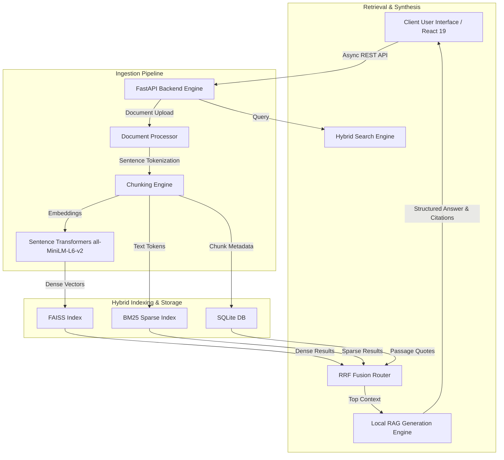

# 🏛️ KRONOS — Secure Local Document Intelligence & Air-Gapped RAG Platform


**KRONOS** is a privacy-first, enterprise-grade Retrieval-Augmented Generation (RAG) and Document Intelligence platform designed to run **100% locally on air-gapped systems**. It allows enterprise organizations (Healthcare, Defense, Legal, Finance) to ingest, index, and query confidential document corpuses without sending data to third-party cloud APIs.

---

## 🌟 Key Features

* **🛡️ 100% Air-Gapped & Local:** Zero internet dependency. No data ever leaves your local network or server hardware.
* **🔍 Hybrid Sparse-Dense Retrieval:** Combines lexical BM25 keyword matching with FAISS L2 vector similarity (`all-MiniLM-L6-v2`) via Reciprocal Rank Fusion (RRF) for high precision across technical terms and semantic queries.
* **⚡ Incremental Ingestion Engine:** Fast, non-blocking document indexing supporting PDF, DOCX, CSV, XLSX, and TXT files.
* **🎯 Line-Level Passage Quote Extraction:** Dynamic match scoring (0–100%) paired with exact line snippet highlights directly from source files.
* **🤖 Local RAG Intelligence & Citation:** Structured AI synthesis that formats thematic insights, source citations, and confidence metrics locally.
* **📜 GDPR & Compliance Audit Trail:** SQLite-backed audit log engine recording all access attempts, query histories, and retention event logs.
* **📱 Responsive Modern Interface:** Built with React 19, Vite, and Tailwind CSS featuring live XHR upload progress, customizable retrieval controls, and interactive chat panels.

---

## 🏗️ System Architecture



---

## 💻 Tech Stack

### **Backend & AI Core**
* **Framework:** Python 3.14 / FastAPI
* **NLP & Vector Embeddings:** PyTorch, Sentence-Transformers (`all-MiniLM-L6-v2`), NLTK (`sent_tokenize`)
* **Vector & Sparse Search:** FAISS (`IndexFlatL2` / `IndexIVFPQ`), `rank_bm25` (BM25Okapi)
* **Local Inference:** Ollama (Llama 3.2 1B) / Local Extractive Context Synthesizer
* **Document Parsers:** `pdfplumber`, `PyPDF2`, `python-docx`, `pandas`
* **Database & Logs:** SQLite3, Python `logging`

### **Frontend Interface**
* **Framework:** React 19, React Router DOM v7
* **Build Tool:** Vite 8
* **Styling:** Tailwind CSS, Material Symbols Outlined

---

## 🚀 Quick Start

### 1. Prerequisites
* Python 3.10+
* Node.js 18+

### 2. Backend Setup
```bash
# Clone repository
git clone https://github.com/jeromeprince777/KRONOS-RAG.git
cd KRONOS-RAG/backend

# Initialize Python Virtual Environment
python -m venv venv
# Windows:
venv\Scripts\activate
# Linux/macOS:
source venv/bin/activate

# Install dependencies
pip install -r requirements.txt

# Run FastAPI Server
python app.py
```
*Backend API will be live at:* `http://localhost:8000`

### 3. Frontend Setup
```bash
cd ../frontend

# Install dependencies
npm install

# Run Development Server (Hosted on Local Host Network)
npm run dev -- --host 0.0.0.0
```
*Frontend UI will be live at:* `http://localhost:5173` (Local) and `http://<your-local-ip>:5173` (LAN Network).

---

## 📊 API Endpoint Overview

| Method | Endpoint | Description |
| :--- | :--- | :--- |
| `POST` | `/api/documents/upload` | Ingests and indexes single/multiple documents incrementally |
| `GET` | `/api/documents` | Lists all indexed documents, chunk totals, and disk storage usage |
| `DELETE` | `/api/documents/{doc_id}` | Removes document chunks from SQLite and updates indexes |
| `POST` | `/api/search` | Performs hybrid BM25 + FAISS search and generates RAG response |
| `GET` | `/api/compliance/report` | Generates structured GDPR audit and access logs report |
| `GET` | `/api/settings` | Retrieves current vector search and model configuration |
| `POST` | `/api/settings` | Updates retrieval parameters at runtime |
| `GET` | `/api/health` | System status and active configuration health check |

---

## 📄 License

Distributed under the MIT License. See `LICENSE` for more information.

---

<p align="center">
  Developed by <a href="https://github.com/jeromeprince777">Jerome Prince</a> 🛡️ KRONOS Document Intelligence
</p>
